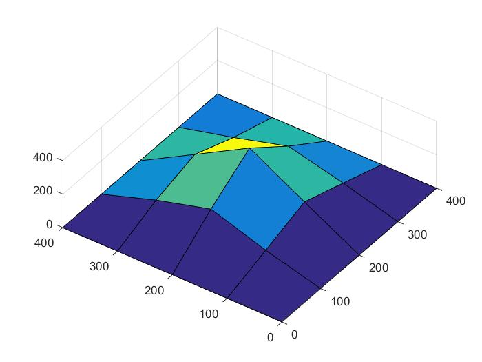

# Analysis of Mindlin Plate

This work is my case study in Finite Element Method course at Vietnam
National University Ho Chi Minh, University of Science. The topic is
about Mindlin Plate in bending. I used the isoparametric quadrilateral
element with 4 nodes to approximate the finite element method for
the plate with the Mindlin theory. 

## Authors

- [Le Dinh Tan](https://github.com/ledinhtan)

## Plate Problem

A given structure of plate made of steel has Young modulus E = 200
gPa and Poisson's ratio nu = 0.3. The size of plate is 400x400x2
mm subjected to the concentrated load placed in the centre of the
plate P = 500 N, and all edges of plate are fixed. Find the bending 
of the plate based on the Mindlin theory.

## Numerical Results

The following figure illustrates the bending of plate with Mindlin
theory:

Running the code to see the numerical results.
## Programming Language

**Programming language:** Matlab

**Version:** 2014a Version